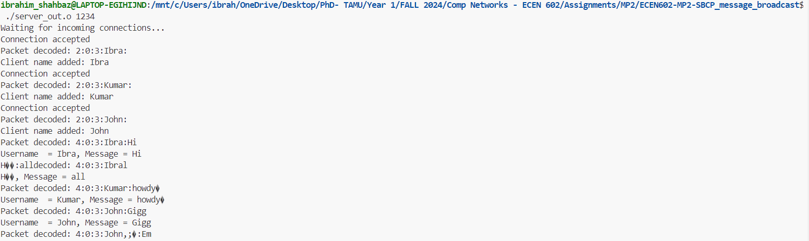
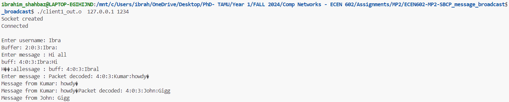
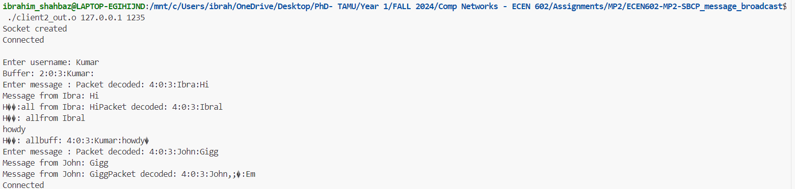
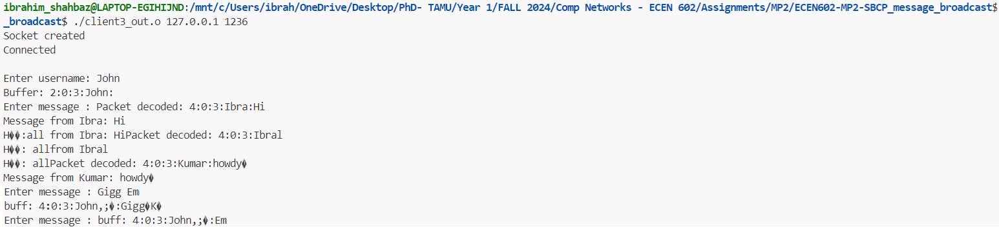
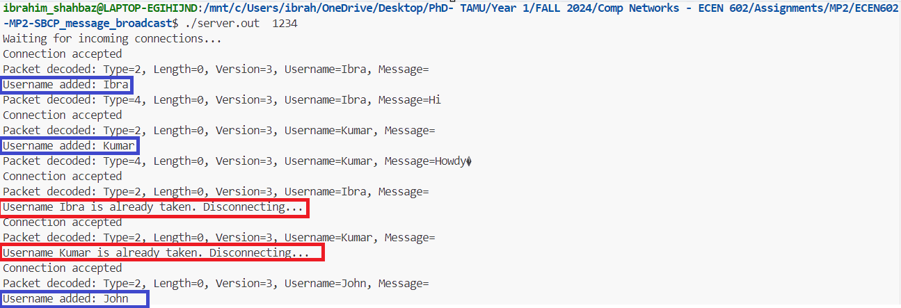
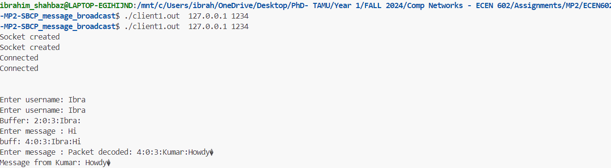
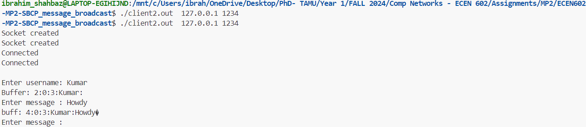
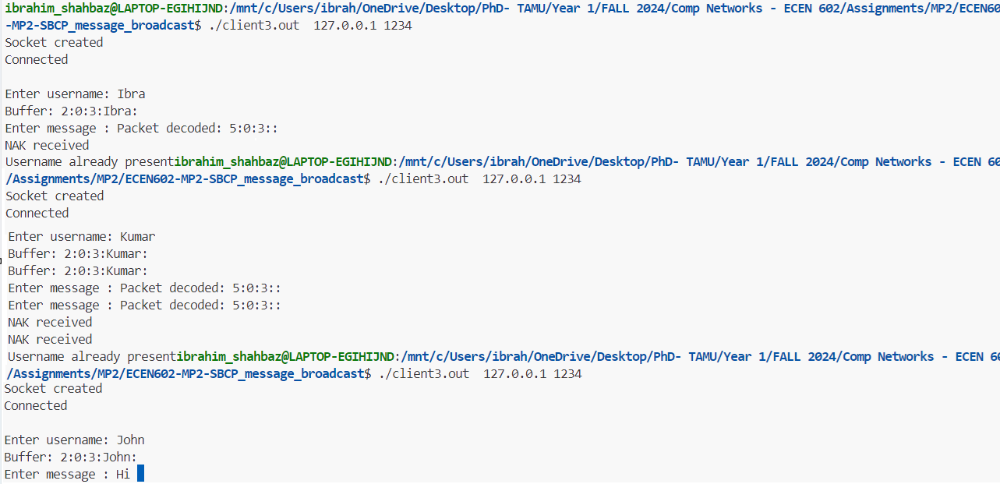

# ECEN602-MP2-SBCP_message_broadcast
ECEN 602 Machine Problem-2

## Test Case Execution

1. Normal operation of the chat 
 
In this test case, three clients are connected to the server. The server is able to broadcast messages sent by clients alongside their usernames.

    Server side
    
 
    Client#1 side
    

    Client#2 side
    

    Client#3 side
    

2. Duplicate usernames rejected
 
In this test case, two different clients connect to the server chat room, and a third client tries to join with a username that is already reserved for the first two clients. The server rejects the third client join request until it joins with a different username.

    Server side
    

    Client#1 side
    

    Client#2 side
    

    Client#3 side
    

