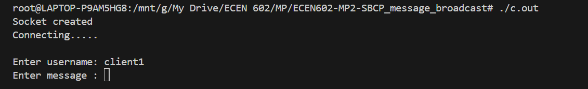

# ECEN602-MP2-SBCP_message_broadcast
ECEN 602 Machine Problem-2

This project implements broadcasting of client messages like a group chat using a server communicating using SBCP protocol.

If a client tries to connect, the server will only allow the client if the username is unique or the client is reconnecting(previously connected to server). Client gets the status of connection based on ACK/NACK received from the server.

## Steps for execution
1. run "make all"
2. To run server: use "make echos"
3. To run client: Use "make echo"

## Test Case Execution

1. Normal operation of the chat 
 
In this test case, three clients are connected to the server. The server is able to broadcast messages sent by clients alongside their usernames.

Server side

Client#1 side

Client#2 side

Client#3 side

2. Duplicate usernames rejected
 
In this test case, two different clients connect to the server chat room, and a third client tries to join with a username that is already reserved for the first two clients. The server rejects the third client join request until it joins with a different username.

Server side

Client#1 side

Client#2 side

Client#3 side

3. server allows a previously used username to be reused

In this test case, clients "shubh" and "ibrahim" connects to the client and then it disconnects. "shubh" is disconnected and later able to connect from another terminal.

Server side

Client#1 side

Client#2 side

Client#3 side

4. server rejects the client because it exceeds the maximum number of clients 
allowed

In this test case, the server's max limit is set to 3. The initial 3 clients are able to connect to the client while the 4th client gets NAK message with reason "Maximum limit reached".

Server side

Client#1 side

Client#2 side

Client#3 side

Client#4 side (Rejected by server)

5. Bonus feature

Test Case 2 and 3 implements NACK to get feedback from the server.

## Contributions

Shubham Santosh Kumar(UIN: 835008989): Implemented Server architecture

Ibrahim Shahbaz(UIN: 236001615): Implemented client architecture